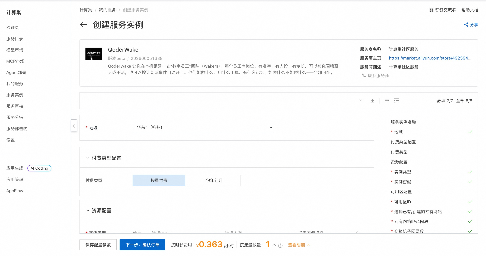
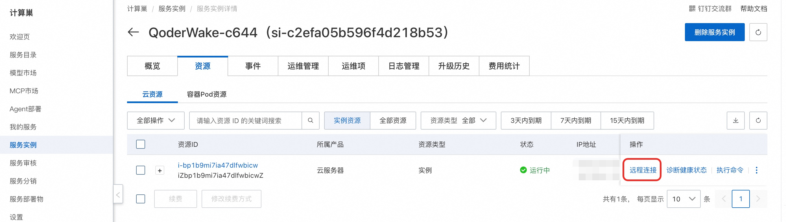
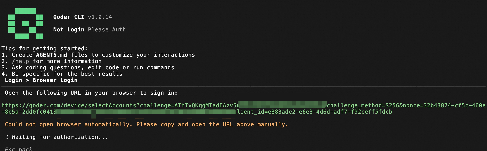
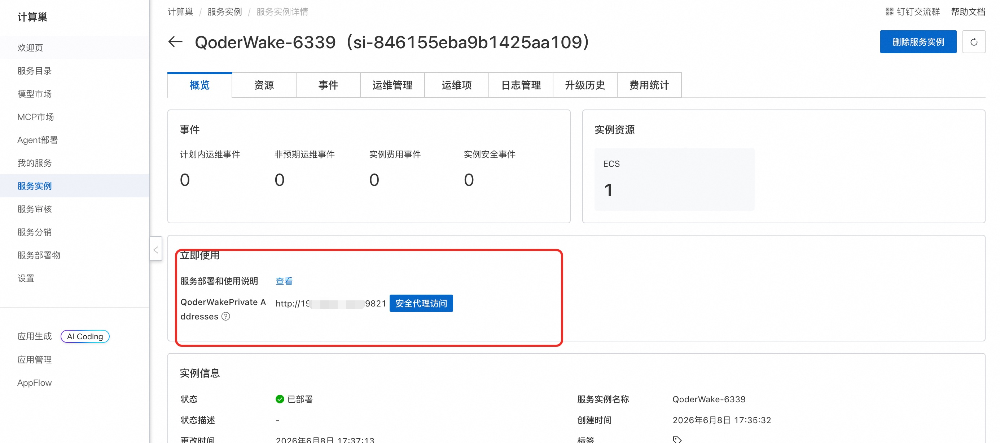
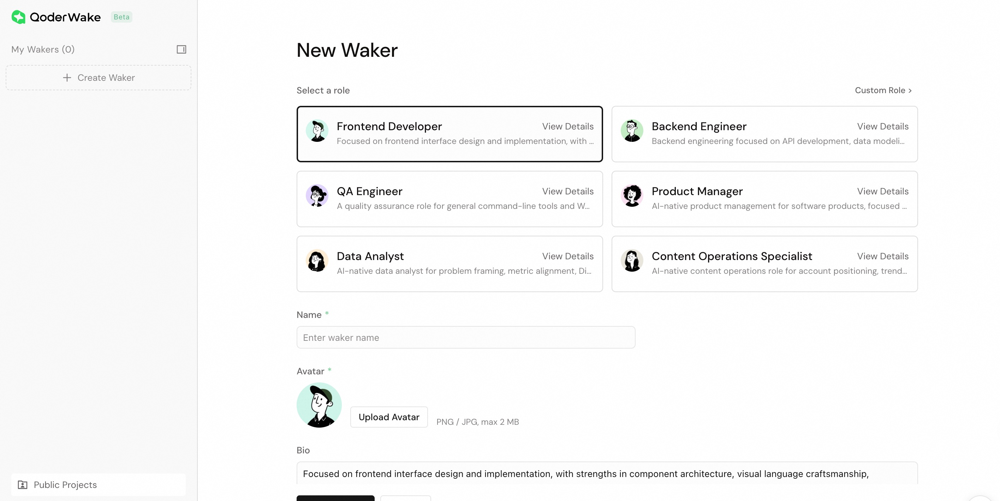

## 🌟 服务简介

> 💥 **告别"做完即忘"，让数字员工成为你 7×24 小时在岗的超级同事！**  
> QoderWake 不只是 Agent 工具——它是有身份、有记忆、有红线的生产级数字员工，自主执行、自动复盘、越用越准，让团队整体产出真正提速！

QoderWake 是阿里巴巴推出的业界首个安全可控、持续进化的生产级数字员工产品，能在真实工作中承担软件工程师、运营、分析师等岗位角色。它采用创新的
Harness-First 架构，每次执行后会把经验沉淀到记忆、技能、策略、验证规则和工作流五个维度，并基于内置的防腐机制（Anti-Rot Governance）持续淘汰过时经验、合并冲突、撤回失效策略，从根本上解决通用
Agent "做完即忘" 的问题。

## 🚀 部署流程

1. 访问计算巢 QoderWake
   社区版 [部署链接](https://computenest.console.aliyun.com/service/instance/create/cn-hangzhou?type=user&ServiceId=service-a4510bdaf9594373b966)
   ，按页面提示填写部署参数：  
   

2. 参数配置完成后，系统将自动生成**费用预估明细**。确认资源配置无误后，点击 **下一步：确认订单**。

3. 在订单确认页，确认后点击 **立即创建** 开始部署。

4. 部署完成后，通过控制台远程连接ECS。
   

## 💡使用示例

1. 通过 TUI 登录 Qoder，在终端中启动 qodercli ：
   ```bash
   sudo su
   cd /root
   source /root/.profile
   qodercli
   ```

2. 在交互式界面完成授权，然后选择 Login with Qoder Platform (Browser) ：

   

3. 复制完整链接在浏览器打开并批准登录。

4. 登录完成后，Ctrl+C 退出 qodercli，然后执行 qoderwake 命令启动服务：
   ```bash
   qoderwake start
   nohup socat TCP-LISTEN:19821,fork,reuseaddr TCP:127.0.0.1:19820 >/dev/null 2>&1 &
   ```

5. 服务启动后，可以通过安全代理访问 WebUi。
   
   
   
   


## 📚 使用指南

使用请参考 QoderWake [官方文档](https://qoder.com/qoderwake) 了解完整能力与数字员工岗位列表。
